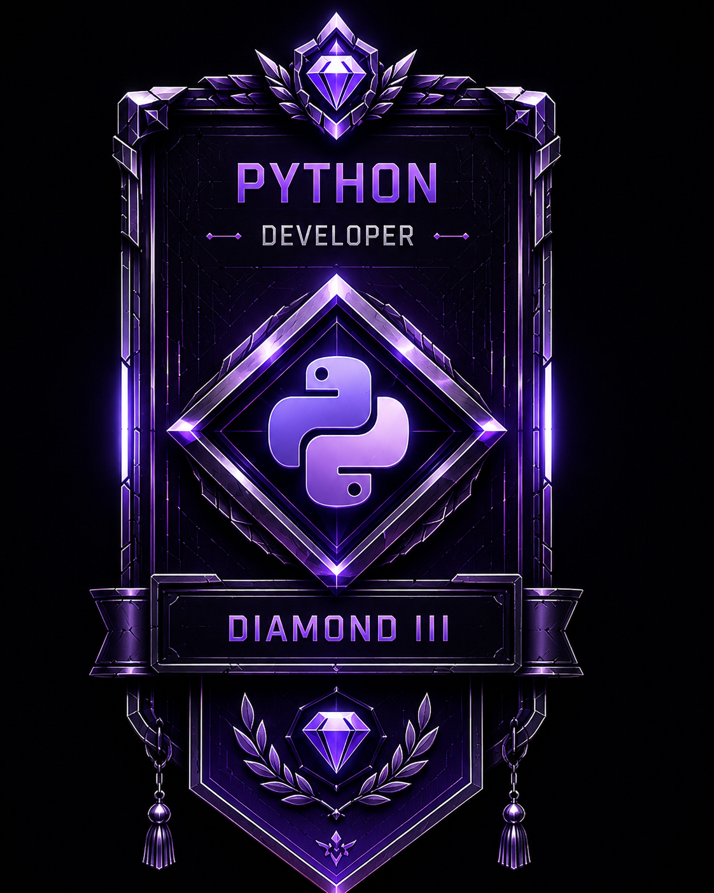
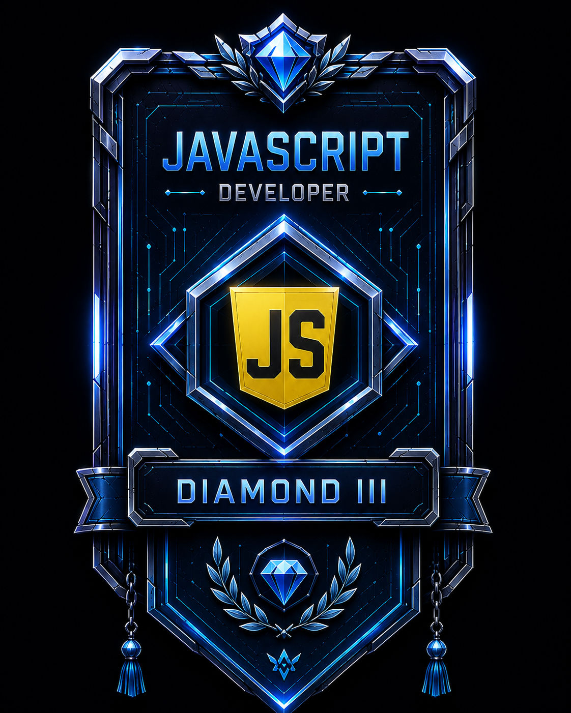
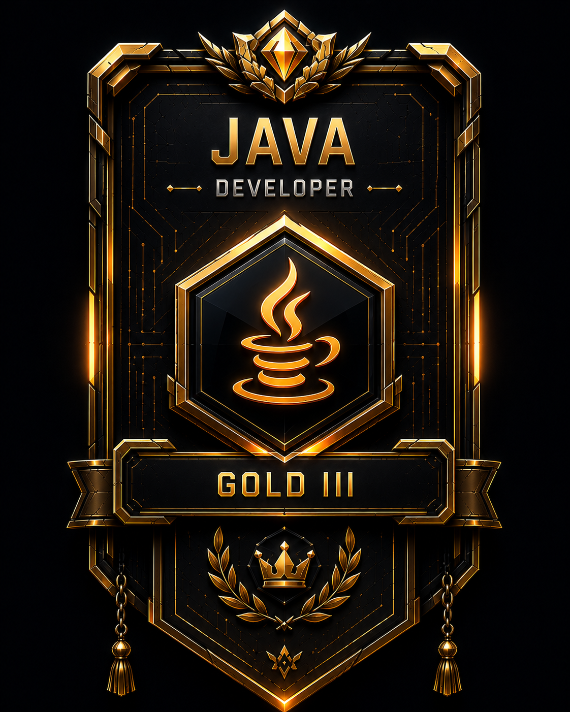
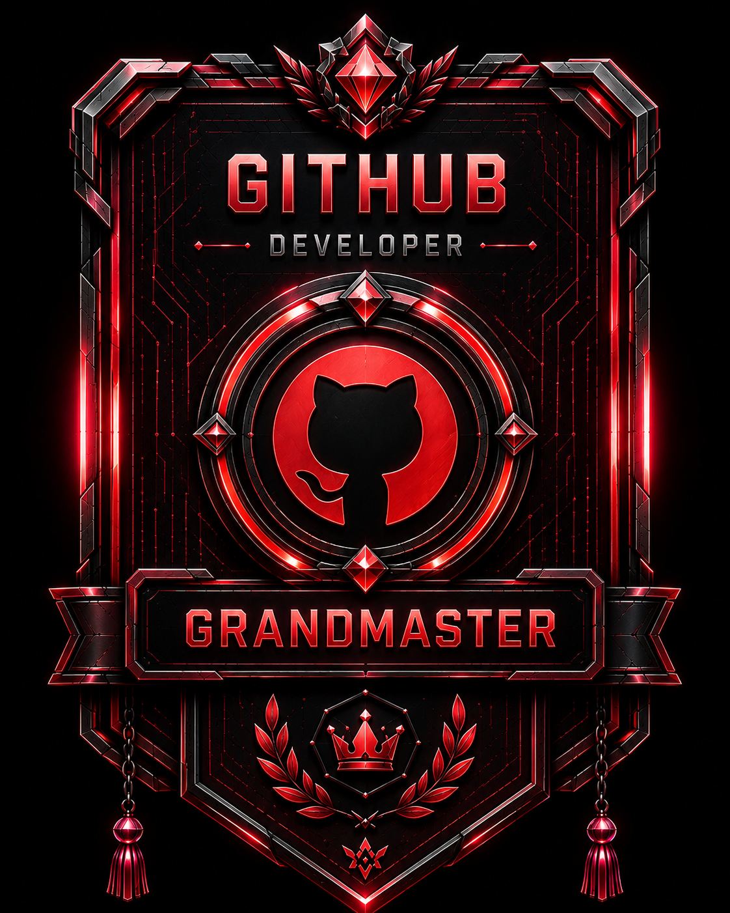

  
  

# ⚡ ⚔️ Arya! 🎮 ✨ 

*🌀 Vibing to Lo-Fi Anime Beats 🎧 | Crafting Full-Stack Worlds 💻 | Leveling Up Code 🚀*

***"People die if they are killed... but code lives forever if it's pushed."***  
An aspiring Full-Stack Developer slingin' Python, JavaScript, and Java to build epic software! ⚔️

 

  
  
  
  

<h2 align="center">
  
</h2>

  
   
  

---

<h2 align="center">
  
</h2>

  
    
  

    
    
    
    
  

---
*Skill Attributes:*

| Spell / Element | Master Level | Rank |
| :--- | :--- | :--- |
| 🐍 **Python** | Backend & Automation | S-Rank ⭐⭐⭐⭐☆ |
| 📜 **JavaScript** | Frontend & Web Jutsu | A-Rank ⭐⭐⭐☆☆ |
| ☕ **Java** | Object-Oriented Architecture | A-Rank ⭐⭐⭐☆☆ |

 

  
  
  

<h2 align="center">
  
</h2>

  
  
  
  

---

<h2 align="center">
  
</h2>

| **Arya's Guild Stats** | **Quest Progress** |
| :--- | :--- |
| ⭐ **Total Stars:** `0` | ⚡ **Class:** Full-Stack Web Dev |
| 🔄 **Commits:** Continuous Training | 🔥 **Current Training:** Python • JS • Java |
| 🔀 **Pull Requests:** `0` | 🎯 **Ultimate Goal:** Full-Stack Mastery |
| 🐛 **Bugs Defeated:** `0` | 📈 **Target:** Legendary App Builder |

 
---

<h2 align="center">
  
</h2>

| **Primary Magic Attributes** |
| :--- |
| 🐍 **Python** `40%` &nbsp;&nbsp;&nbsp;&nbsp;&nbsp;&nbsp;&nbsp;&nbsp; 📜 **JavaScript** `30%` |
| ☕ **Java** `20%` &nbsp;&nbsp;&nbsp;&nbsp;&nbsp;&nbsp;&nbsp;&nbsp;&nbsp;&nbsp;&nbsp;&nbsp; 🌐 **HTML / CSS** `10%` |

---

### ⚡ Active Arc Stack

| Skill / Tech | Proficiency | Status |
| :--- | :--- | :--- |
|  | Advanced | Daily Training 🟢 |
|  | Intermediate | Constructing Apps 🟡 |
|  | Intermediate | OOP Fundamentals 🟡 |
|  | Beginner / Inter | Frontend Spells 🔵 |

### 🧪 Epic Quests & Main Storyline

* 🌐 **Full-Stack Web App** 🚀 : High-level interactive frontend backed by RESTful APIs.
* 🤖 **Python Utility Scripts** 🐍 : Automating routine tasks with clean code execution.
* ☕ **Java OOP Projects** 🏗️ : Deep diving into scalable system designs and data structures.

### 🎯 Endgame Goal & Saga

🌱 **Current Training Arc:** Mastering Full-Stack Web Development with Python, JS, and Java.  
💬 **Ultimate Quest:** Deploying seamless, world-class web applications.  
⚔️ **Current Focus:** REST APIs, database design, and frontend interactivity.

---

### 🤝 Join the Party!

Ready to form a guild or collaborate on a project? Hit me up! ☕

  
  
  
  

<!-- Anime Tech Signature -->

  

### 📜 Copyright & License

  
  

© 2026 **Arya** (`Techno-arya`). All rights reserved.

